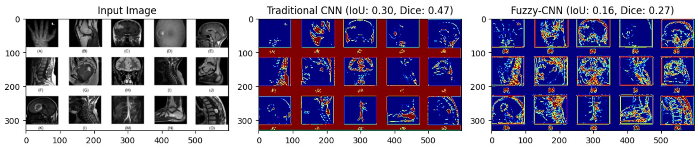

# Fuzzy-CNN Segmentation

This repository contains an implementation of fuzzy and CNN-based segmentation for medical images. The code provides preprocessing, fuzzification, segmentation, and evaluation functionalities.

## How to Run

### Clone the Repository
```bash
git clone https://github.com/your-username/fuzzy-cnn-segmentation.git
cd FUZZY-CNN-for-medical-image-segmentation
```

### Install Dependencies
Install the required Python libraries:
```bash
pip install numpy matplotlib
```

### Set the Image Path
1. Place your medical image in the repository folder.
2. Update the image path in `main.py`:
    ```python
    input_image = plt.imread('path/to/your/image.jpg')[:, :, 0]
    ```

### Run the Program
Run the segmentation script:
```bash
python main.py
```

### View Results
- The program will display:
  1. The input medical image.
  2. Traditional CNN segmentation results with IoU and Dice metrics.
  3. Fuzzy-CNN segmentation results with IoU and Dice metrics.

---
### Example Output
- Below is an example output of the segmentation process:
  

---

## Repository Structure
```
|-- fuzzy-cnn-segmentation
    |-- main.py       # The main script for fuzzy and traditional CNN segmentation
    |-- README.md     # This readme file
    |-- requirements.txt # Dependencies list (optional)
    |-- example.jpg   # Example medical image (if applicable)
```

## License
This project is licensed under Dhiraj.

